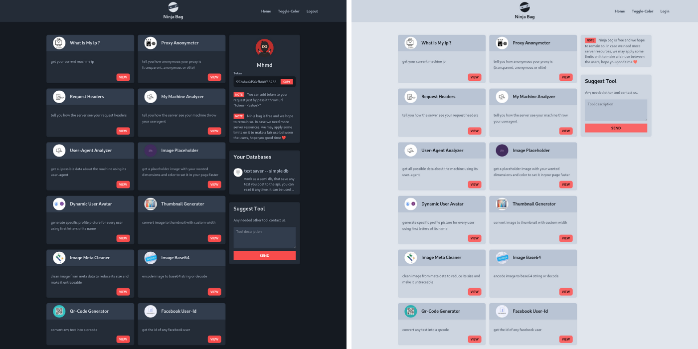
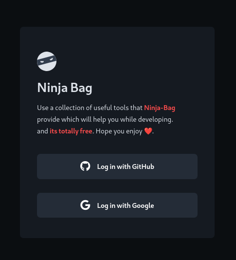
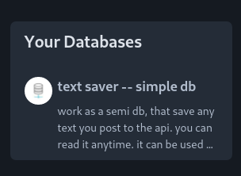
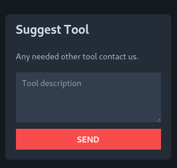
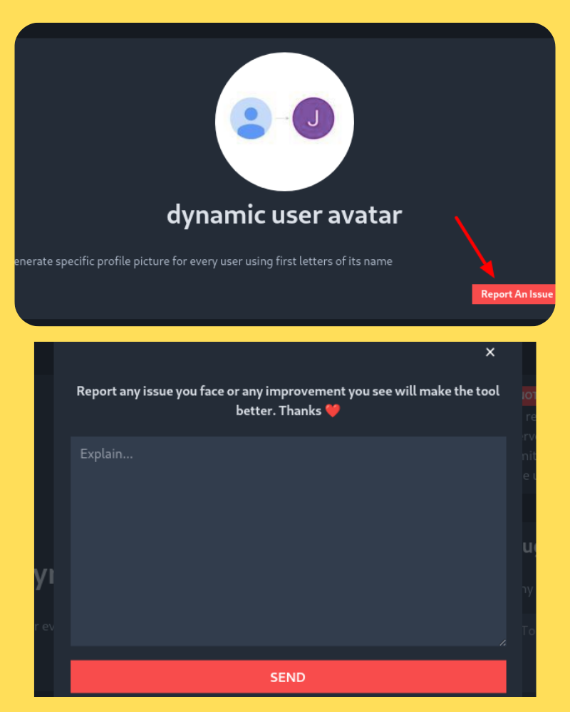
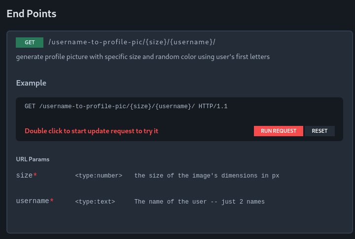
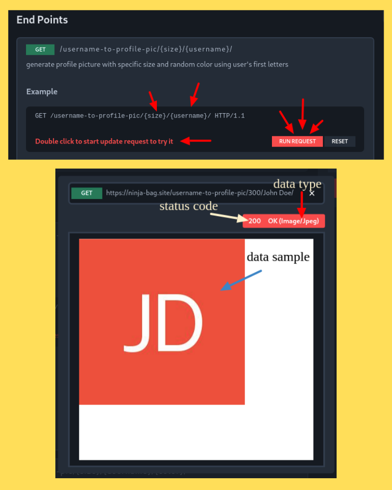

# NINJA BAG

Collection of useful tools mainly for developers, all free and in one place.

as an example

- **TextSaver Tool** : it can work as a simple db to collect your forms, and check if line exist
- **CORS Proxy** : work as a simple proxy to make requests from the browser and skip cors policy
- **Server Mirror Tools** : another punch of tools tell you how server see you (ip, proxy anonymity, request headers, and more....)
- **Some Image Based Tools**

## Live Demo

I hope you give a look on my [ninja-bag](https://ninja-bag.site) and give me a feedback in **_suggest box_** 🤓

### server info

- linux server **Ubuntu**
- it hosted on [_linode_](https://linode.com) server
- using ssl from [let's encrypt](https://letsencrypt.org/)
- **Nginx** web server

## Features

### Dark-Mode Design

### Easy register/login with google or github

### Aside show all databases that user has records in

### Allow user to suggest new tools they may need

### Allow users to report issues faced using the tools

### Well described endpoints with its params and syntax

### Allow users to edit the request and test the endpoint live from the frontend and return output sample, data type and response status-code

## Built With

- **Django**

  - advanced **DataBase ORM** : use ORM wisely to save resources as possible
  - **signals**
  - **debug_toolbar** : to analyze performance and db
  - **middleware** tracker to analyze store all visits
  - **API** to deal with tools
  - **Authentication** using social accounts
  - rewrite model's **Managers**
  - Custom **Template Filters**

- **Alpine.js** : simple js lib give reactivity and some directives make code more fancy, most important its small 😅
  - i avoided vue/react because it will seem like **_Trying to kill a fly with a sledgehammer_**
  - light/dark mode using invert technique (**_one line of CSS_** 😅)
- All tools are written in python using libs like (Pillow, requests, and more...)

## Note

i didn't write installation or contribution guide because its not an open source project, **its on github to let companies i applied for, to see my coding skills**

## License

This project is licensed under the MIT License - see the [LICENSE](LICENSE) file for details
